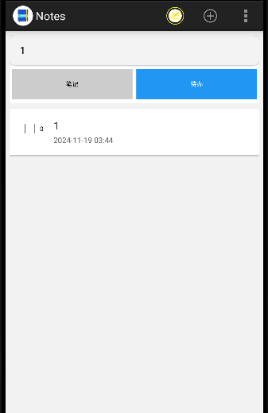
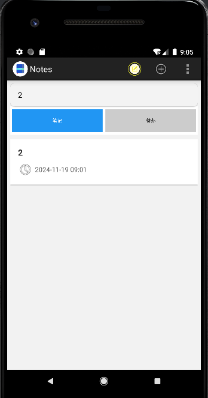
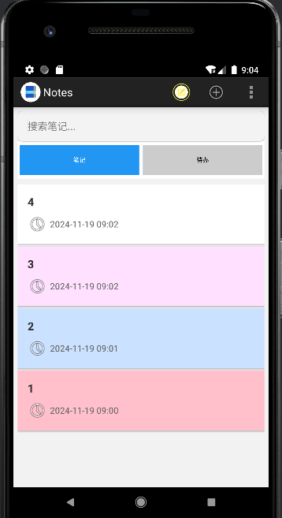
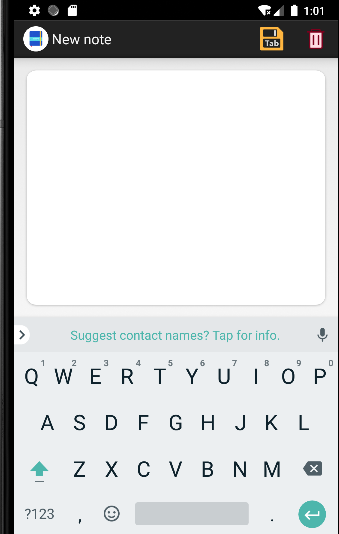
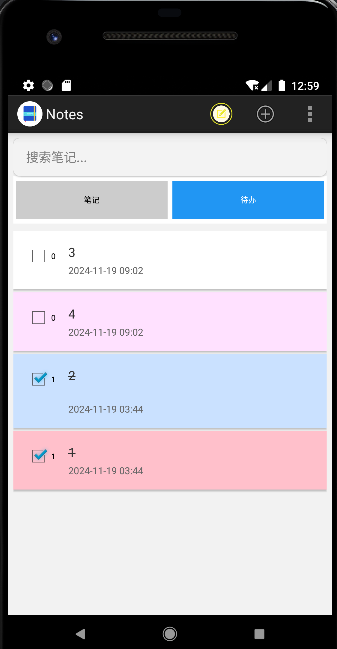

# NotePad


### 一. `功能`
1. NoteList界面中笔记条目增加时间戳显示；
2. 添加笔记查询功能（根据标题或内容查询）；
3. UI美化；
4. 添加代办功能；
### 二. 笔记条目增加时间戳


1.定义TextView,用于显示笔记的时间信息。

```properties
 <TextView
                android:id="@+id/text_note_time"
                android:layout_width="wrap_content"
                android:layout_height="wrap_content"
                android:textSize="12sp"
                android:textColor="#666666"/>
```

2.针对ID为`R.id.text_note_time`的`TextView`，将`Cursor`中的时间戳数据转换为可读的日期时间格式，并显示在相应的`TextView`上。

```properties
 adapter.setViewBinder(new SimpleCursorAdapter.ViewBinder() {
            @Override
            public boolean setViewValue(View view, Cursor cursor, int columnIndex) {
                // 处理时间显示
                if (view.getId() == R.id.text_note_time) {
                    long timestamp = cursor.getLong(columnIndex);
                    SimpleDateFormat sdf = new SimpleDateFormat("yyyy-MM-dd HH:mm");
                    String dateStr = sdf.format(new Date(timestamp));
                    ((TextView) view).setText(dateStr);
                    return true;
                }
```

### 三. 添加笔记查询功能





1. 添加笔记搜索方法。performSearch方法用于根据用户输入的查询字符串搜索笔记标题，并更新列表视图以显示匹配的搜索结果。它首先构建查询条件，然后执行数据库查询，获取结果集。接着，使用SimpleCursorAdapter将查询结果绑定到列表视图的指定列和视图ID上，并最终更新列表视图以显示搜索到的笔记标题和创建日期。

```properties
 private void performSearch(String query) {
        String selection = null;
        String[] selectionArgs = null;

        if (!TextUtils.isEmpty(query)) {
            selection = NotePad.Notes.COLUMN_NAME_TITLE + " LIKE ?";
            selectionArgs = new String[]{"%" + query + "%"};
        }

        Cursor cursor = managedQuery(
                getIntent().getData(),
                PROJECTION,
                selection,
                selectionArgs,
                NotePad.Notes.DEFAULT_SORT_ORDER
        );

        String[] dataColumns = {
                NotePad.Notes.COLUMN_NAME_TITLE,
                NotePad.Notes.COLUMN_NAME_CREATE_DATE
        };

        int[] viewIDs = {
                android.R.id.text1,
                R.id.text_note_time
        };

        SimpleCursorAdapter adapter = getSimpleCursorAdapter(cursor, dataColumns, viewIDs);
        setListAdapter(adapter);
    }
```

2. 添加待办事项搜索方法

```properties
private void performTodoSearch(String query) {
        String selection = null;
        String[] selectionArgs = null;

        if (!TextUtils.isEmpty(query)) {
            selection = NotePad.TodoItems.COLUMN_NAME_TITLE + " LIKE ?";
            selectionArgs = new String[]{"%" + query + "%"};
        }

        Cursor cursor = managedQuery(
                NotePad.TodoItems.CONTENT_URI,  // 使用待办事项的URI
                new String[] {  // 待办事项的列
                        NotePad.TodoItems._ID,
                        NotePad.TodoItems.COLUMN_NAME_TITLE,
                        NotePad.TodoItems.COLUMN_NAME_CREATE_DATE,
                        NotePad.TodoItems.COLUMN_NAME_COMPLETED  // 新增完成状态列
                },
                selection,
                selectionArgs,
                NotePad.TodoItems.DEFAULT_SORT_ORDER
        );

        String[] dataColumns = {
                NotePad.TodoItems.COLUMN_NAME_TITLE,
                NotePad.TodoItems.COLUMN_NAME_CREATE_DATE,
                NotePad.TodoItems.COLUMN_NAME_COMPLETED
        };

        int[] viewIDs = {
                android.R.id.text1,
                R.id.text_note_time,
                R.id.checkbox_todo
        };

        SimpleCursorAdapter adapter = getTodoCursorAdapter(cursor, dataColumns, viewIDs);
        setListAdapter(adapter);
    }

```

3.添加点击事件。

```properties

        notesTab.setOnClickListener(v -> {
            notesTab.setBackgroundColor(Color.rgb(33, 150, 243));
            notesTab.setTextColor(Color.WHITE);
            todoTab.setBackgroundColor(Color.LTGRAY);
            todoTab.setTextColor(Color.BLACK);
            performSearch(searchBox.getText().toString());
        });

        todoTab.setOnClickListener(v -> {
            todoTab.setBackgroundColor(Color.rgb(33, 150, 243));
            todoTab.setTextColor(Color.WHITE);
            notesTab.setBackgroundColor(Color.LTGRAY);
            notesTab.setTextColor(Color.BLACK);
            performTodoSearch(searchBox.getText().toString());
        });

```

### 四. UI美化




1.根据位置循环设置颜色

```properties
{
  private final String[] colors = {"#ffffff", "#ffe1ff", "#cae1ff", "#ffc0cb"};
  @Override
  	public View getView(int position, View convertView, ViewGroup parent) {
           View view = super.getView(position, convertView, parent);
           view.setBackgroundColor(Color.parseColor(colors[position % 4]));
           return view;
 }
 
```

2.导航栏美化

```properties
<?xml version="1.0" encoding="utf-8"?>
<menu xmlns:android="http://schemas.android.com/apk/res/android">
    <!--  This is our one standard application action (creating a new note). -->
    <item android:id="@+id/menu_add"
          android:icon="@drawable/ic_menu_compose"
          android:title="@string/menu_add"
          android:alphabeticShortcut='a'
          android:showAsAction="always" />
    <item
        android:id="@+id/menu_add_todo"
        android:icon="@android:drawable/ic_menu_add"
        android:showAsAction="always"
        android:title="新建待办" />
    <!--  If there is currently data in the clipboard, this adds a PASTE menu item to the menu
          so that the user can paste in the data.. -->
    <item android:id="@+id/menu_paste"
          android:icon="@drawable/ic_menu_compose"
          android:title="@string/menu_paste"
          android:alphabeticShortcut='p' />
</menu>
```

```properties
<?xml version="1.0" encoding="utf-8"?>
<menu xmlns:android="http://schemas.android.com/apk/res/android">
    <item android:id="@+id/menu_save"
          android:icon="@drawable/ic_menu_save"
          android:alphabeticShortcut='s'
          android:title="@string/menu_save"
          android:showAsAction="ifRoom|withText" />
    <item android:id="@+id/menu_revert"
          android:icon="@drawable/ic_menu_revert"
          android:title="@string/menu_revert" />
    <item android:id="@+id/menu_delete"
          android:icon="@drawable/ic_menu_delete"
          android:title="@string/menu_delete"
          android:showAsAction="ifRoom|withText" />
</menu>
```

### 五. `添加代办功能`


1. 在数据库创建时创建待办表

```
  @Override
       public void onCreate(SQLiteDatabase db) {
           db.execSQL("CREATE TABLE " + NotePad.Notes.TABLE_NAME + " ("
                   + NotePad.Notes._ID + " INTEGER PRIMARY KEY,"
                   + NotePad.Notes.COLUMN_NAME_TITLE + " TEXT,"
                   + NotePad.Notes.COLUMN_NAME_NOTE + " TEXT,"
                   + NotePad.Notes.COLUMN_NAME_CREATE_DATE + " INTEGER,"
                   + NotePad.Notes.COLUMN_NAME_MODIFICATION_DATE + " INTEGER"
                   + ");");

           db.execSQL("CREATE TABLE " + NotePad.TodoItems.TABLE_NAME + " ("
                   + NotePad.TodoItems._ID + " INTEGER PRIMARY KEY,"
                   + NotePad.TodoItems.COLUMN_NAME_TITLE + " TEXT,"
                   + NotePad.TodoItems.COLUMN_NAME_NOTE + " TEXT,"
                   + NotePad.TodoItems.COLUMN_NAME_CREATE_DATE + " INTEGER,"
                   + NotePad.TodoItems.COLUMN_NAME_MODIFICATION_DATE + " INTEGER,"
                   + NotePad.TodoItems.COLUMN_NAME_COMPLETED + " INTEGER DEFAULT 0"
                   + ");");
       }
```

2.在查询方法中添加对待办的支持

```
 @Override
   public Cursor query(Uri uri, String[] projection, String selection,
                       String[] selectionArgs, String sortOrder) {
       SQLiteQueryBuilder qb = new SQLiteQueryBuilder();

       switch (sUriMatcher.match(uri)) {
           case TODOS:
               qb.setTables(NotePad.TodoItems.TABLE_NAME);
               break;
           case TODO_ID:
               qb.setTables(NotePad.TodoItems.TABLE_NAME);
               qb.appendWhere(NotePad.TodoItems._ID + "=" + uri.getLastPathSegment());
               break;
           case NOTES:
               qb.setTables(NotePad.Notes.TABLE_NAME);
               break;
           case NOTE_ID:
               qb.setTables(NotePad.Notes.TABLE_NAME);
               qb.appendWhere(NotePad.Notes._ID + "=" + uri.getLastPathSegment());
               break;
           default:
               throw new IllegalArgumentException("Unknown URI " + uri);
       }

       SQLiteDatabase db = mOpenHelper.getReadableDatabase();
       Cursor c = qb.query(db, projection, selection, selectionArgs,
               null, null, sortOrder);
       c.setNotificationUri(getContext().getContentResolver(), uri);
       return c;
   }
```

3.判断是插入笔记还是待办，插入

```
// 根据传入的URI判断是插入笔记还是待办
        switch (sUriMatcher.match(uri)) {
            case NOTES:
                // 插入笔记
                ContentValues values = new ContentValues(initialValues);
                // If the values map doesn't contain the creation date, sets it to the current time.
                if (values.containsKey(NotePad.Notes.COLUMN_NAME_CREATE_DATE) == false) {
                    values.put(NotePad.Notes.COLUMN_NAME_CREATE_DATE, now);
                }

                // If the values map doesn't contain the modification date, sets it to the current time.
                if (values.containsKey(NotePad.Notes.COLUMN_NAME_MODIFICATION_DATE) == false) {
                    values.put(NotePad.Notes.COLUMN_NAME_MODIFICATION_DATE, now);
                }

                // If the values map doesn't contain a title, sets it to "Note" plus the current time
                if (values.containsKey(NotePad.Notes.COLUMN_NAME_TITLE) == false) {
                    Resources r = Resources.getSystem();
                    values.put(NotePad.Notes.COLUMN_NAME_TITLE, "Note " + now);
                }

                // If the values map doesn't contain note text, sets it to an empty string.
                if (values.containsKey(NotePad.Notes.COLUMN_NAME_NOTE) == false) {
                    values.put(NotePad.Notes.COLUMN_NAME_NOTE, "");
                }

                // Opens the database object in "write" mode.
                SQLiteDatabase db = mOpenHelper.getWritableDatabase();

                // Performs the insert and returns the ID of the new note.
                long rowId = db.insert(
                        NotePad.Notes.TABLE_NAME,        // The table to insert into.
                        NotePad.Notes.COLUMN_NAME_NOTE,  // A hack, SQLite sets this column value to null
                        // if values is empty.
                        values                           // A map of column names, and the values to insert
                        // into the columns.
                );

                // If the insert succeeded, the row ID exists.
                if (rowId > 0) {
                    // Creates a URI with the note ID pattern and the new row ID appended to it.
                    Uri noteUri = ContentUris.withAppendedId(NotePad.Notes.CONTENT_URI, rowId);

                    // Notifies observers registered against this provider that the data changed.
                    getContext().getContentResolver().notifyChange(noteUri, null);
                    return noteUri;
                }
                break;

            case TODOS:
                // 插入待办
                ContentValues todoValues = new ContentValues(initialValues);

                if (todoValues.containsKey(NotePad.TodoItems.COLUMN_NAME_CREATE_DATE) == false) {
                    todoValues.put(NotePad.TodoItems.COLUMN_NAME_CREATE_DATE, now);
                }

                if (todoValues.containsKey(NotePad.TodoItems.COLUMN_NAME_MODIFICATION_DATE) == false) {
                    todoValues.put(NotePad.TodoItems.COLUMN_NAME_MODIFICATION_DATE, now);
                }

                if (todoValues.containsKey(NotePad.TodoItems.COLUMN_NAME_TITLE) == false) {
                    Resources r = Resources.getSystem();
                    todoValues.put(NotePad.TodoItems.COLUMN_NAME_TITLE, "Todo " + now);
                }

                if (todoValues.containsKey(NotePad.TodoItems.COLUMN_NAME_NOTE) == false) {
                    todoValues.put(NotePad.TodoItems.COLUMN_NAME_NOTE, "");
                }

                if (todoValues.containsKey(NotePad.TodoItems.COLUMN_NAME_COMPLETED) == false) {
                    todoValues.put(NotePad.TodoItems.COLUMN_NAME_COMPLETED, 0);
                }

                SQLiteDatabase todoDB = mOpenHelper.getWritableDatabase();
                long todoRowId = todoDB.insert(
                        NotePad.TodoItems.TABLE_NAME,
                        NotePad.TodoItems.COLUMN_NAME_NOTE,
                        todoValues
                );

                if (todoRowId > 0) {
                    Uri todoUri = ContentUris.withAppendedId(NotePad.TodoItems.CONTENT_URI, todoRowId);
                    getContext().getContentResolver().notifyChange(todoUri, null);
                    return todoUri;
                }
                break;

            default:
                throw new IllegalArgumentException("Unknown URI " + uri);
        }
```

4.关于待办事项的搜索方法见：三. 添加笔记查询功能

5.为待办事项列表项设置背景颜色、管理复选框状态，并处理复选框的点击事件，处理标题的删除线。主要是处理用户与列表项中CheckBox的交互，包括更新待办事项的完成状态和视觉反馈。

```properties
 private @NonNull SimpleCursorAdapter getTodoCursorAdapter(Cursor cursor, String[] dataColumns, int[] viewIDs) {
        SimpleCursorAdapter adapter = new SimpleCursorAdapter(
                this,
                R.layout.todo_list_item,
                cursor,
                dataColumns,
                viewIDs
        ) {
            private final String[] colors = {"#ffffff", "#ffe1ff", "#cae1ff", "#ffc0cb"};
            @Override
            public View getView(int position, View convertView, ViewGroup parent) {
                View view = super.getView(position, convertView, parent);
                // 根据位置循环设置颜色
                view.setBackgroundColor(Color.parseColor(colors[position % 4]));
                // 获取当前项的数据
                Cursor cursor = (Cursor) getItem(position);
                // 找到CheckBox
                CheckBox checkBox = view.findViewById(R.id.checkbox_todo);
                // 设置CheckBox的状态
                @SuppressLint("Range") boolean isCompleted = cursor.getInt(cursor.getColumnIndex(NotePad.TodoItems.COLUMN_NAME_COMPLETED)) == 1;
                checkBox.setChecked(isCompleted);
                // 为CheckBox添加点击事件
                checkBox.setOnClickListener(v -> {
                    ContentValues values = new ContentValues();
                    values.put(NotePad.TodoItems.COLUMN_NAME_COMPLETED, checkBox.isChecked() ? 1 : 0);
                    @SuppressLint("Range") long id = cursor.getLong(cursor.getColumnIndex(NotePad.TodoItems._ID));
                    Uri todoUri = ContentUris.withAppendedId(NotePad.TodoItems.CONTENT_URI, id);
                    getContentResolver().update(todoUri, values, null, null);
                    TextView titleView = view.findViewById(android.R.id.text1);
                    if (checkBox.isChecked()) {
                        titleView.setPaintFlags(titleView.getPaintFlags() | Paint.STRIKE_THRU_TEXT_FLAG);
                    } else {
                        titleView.setPaintFlags(titleView.getPaintFlags() & (~Paint.STRIKE_THRU_TEXT_FLAG));
                    }
                });
                return view;
            }
        };

        adapter.setViewBinder(new SimpleCursorAdapter.ViewBinder() {
            @Override
            public boolean setViewValue(View view, Cursor cursor, int columnIndex) {
                // 处理时间显示
                if (view.getId() == R.id.text_note_time) {
                    long timestamp = cursor.getLong(columnIndex);
                    SimpleDateFormat sdf = new SimpleDateFormat("yyyy-MM-dd HH:mm");
                    String dateStr = sdf.format(new Date(timestamp));
                    ((TextView) view).setText(dateStr);
                    return true;
                }
                // 处理标题的删除线
                else if (view.getId() == android.R.id.text1) {
                    TextView titleView = (TextView) view;
                    String title = cursor.getString(columnIndex);
                    titleView.setText(title);

                    // 检查完成状态
                    int completedIndex = cursor.getColumnIndex(NotePad.TodoItems.COLUMN_NAME_COMPLETED);
                    boolean isCompleted = cursor.getInt(completedIndex) == 1;

                    // 根据完成状态设置删除线
                    if (isCompleted) {
                        titleView.setPaintFlags(titleView.getPaintFlags() | Paint.STRIKE_THRU_TEXT_FLAG);
                    } else {
                        titleView.setPaintFlags(titleView.getPaintFlags() & (~Paint.STRIKE_THRU_TEXT_FLAG));
                    }
                    return true;
                }
                return false;
            }
        });

        return adapter;
    }
```

```properties
sNotesProjectionMap.put(NotePad.Notes.COLUMN_NAME_IMAGE, NotePad.Notes.COLUMN_NAME_IMAGE);
```

6.初始化待办事项编辑器的界面，并根据Intent的操作类型来决定是创建一个新的待办事项还是编辑一个现有的待办事项。当用户填写完待办事项的标题和内容并点击保存按钮后，将这些信息保存到数据库中。

```properties
public class TodoEditor extends Activity {
    private EditText mTitleText;
    private EditText mContentText;
    private Uri mUri;

    @Override
    protected void onCreate(Bundle savedInstanceState) {
        super.onCreate(savedInstanceState);
        setContentView(R.layout.todo_editor);

        mTitleText = findViewById(R.id.todo_title);
        mContentText = findViewById(R.id.todo_content);
        Button saveButton = findViewById(R.id.todo_save);

        // 获取intent
        final Intent intent = getIntent();
        final String action = intent.getAction();

        if (Intent.ACTION_EDIT.equals(action)) {
            // 编辑现有待办
            mUri = intent.getData();
            Cursor cursor = managedQuery(mUri, null, null, null, null);
            cursor.moveToFirst();
            mTitleText.setText(cursor.getString(cursor.getColumnIndex(NotePad.TodoItems.COLUMN_NAME_TITLE)));
            mContentText.setText(cursor.getString(cursor.getColumnIndex(NotePad.TodoItems.COLUMN_NAME_NOTE)));
        } else if (Intent.ACTION_INSERT.equals(action)) {
            // 创建新待办
            mUri = getContentResolver().insert(NotePad.TodoItems.CONTENT_URI, new ContentValues());
        }

        saveButton.setOnClickListener(v -> {
            ContentValues values = new ContentValues();
            values.put(NotePad.TodoItems.COLUMN_NAME_TITLE, mTitleText.getText().toString());
            values.put(NotePad.TodoItems.COLUMN_NAME_NOTE, mContentText.getText().toString());
            values.put(NotePad.TodoItems.COLUMN_NAME_MODIFICATION_DATE, System.currentTimeMillis());

            getContentResolver().update(mUri, values, null, null);
            finish();
        });
    }
}

```
